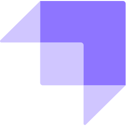
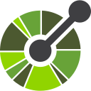
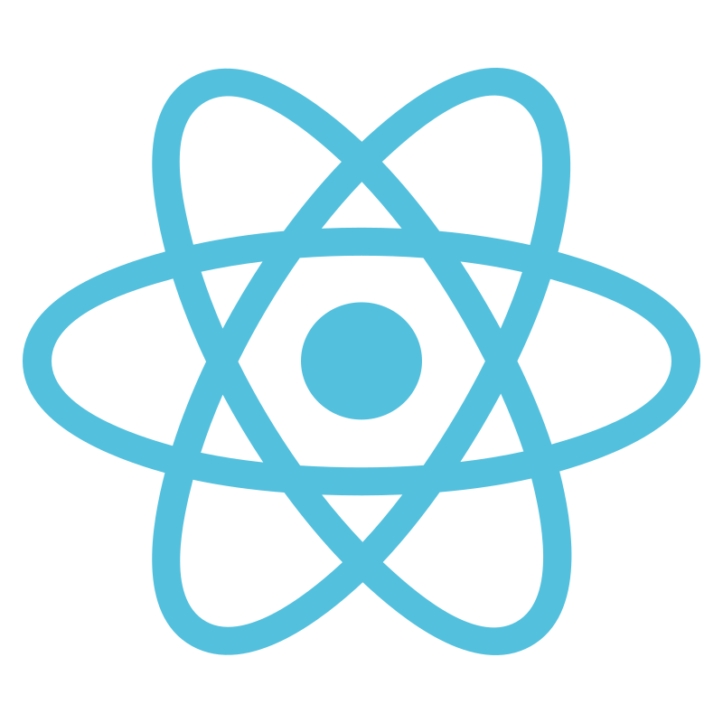
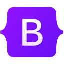
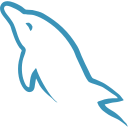
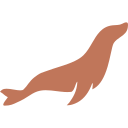

&nbsp;**Ilias Piotopoulos** 
**`Software Engineer | Computer Scientist`**

**Status:** 🟢 Seeking MSc in Computer Science

I design and build backend and full-stack software, with a focus on clean architecture, well-tested code, and secure design.

I am a computer scientist and software engineer who enjoys building things and understanding how they work. I have built web applications and backend systems in the cybersecurity, online media buying, and telecom industries, and I hold a degree in Computer Science and Telecommunications from the University of Athens.

I care about clean, efficient code. I use design patterns where they make a system easier to change, and I rely on unit and integration tests to keep quality high. Curiosity pulls me toward new areas of technology, and I enjoy challenges that push me to learn and grow.

I like being useful to the team I am part of, whether that means improving a process, delivering a solid solution, or helping others finish theirs. I keep looking for chances to push my limits and get a little better every day.

----

<h3 align="center">🧰 Skills</h3>

| Area | Technologies |
|---|---|
| **Languages** |  Java &nbsp;·&nbsp;  C &nbsp;·&nbsp;  C++ &nbsp;·&nbsp;  PHP &nbsp;·&nbsp;  JavaScript &nbsp;·&nbsp;  TypeScript &nbsp;·&nbsp; SQL &nbsp;·&nbsp;  Bash |
| **Backend** |  Spring / Spring Boot &nbsp;·&nbsp;  Kafka &nbsp;·&nbsp;  Keycloak &nbsp;·&nbsp;  Strapi &nbsp;·&nbsp;  OpenAPI |
| **Frontend** |  React &nbsp;·&nbsp;  Vue &nbsp;·&nbsp;  HTML &nbsp;·&nbsp;  CSS / Sass &nbsp;·&nbsp;  Tailwind &nbsp;·&nbsp;  Bootstrap |
| **Databases** |  MySQL &nbsp;·&nbsp;  MariaDB &nbsp;·&nbsp;  PostgreSQL &nbsp;·&nbsp;  MongoDB |
| **DevOps &amp; cloud** |  Docker &nbsp;·&nbsp;  Kubernetes &nbsp;·&nbsp;  AWS &nbsp;·&nbsp;  Linux &nbsp;·&nbsp; CI/CD &nbsp;·&nbsp;  GitLab CI |
| **Tools** |  Git &nbsp;·&nbsp;  Maven &nbsp;·&nbsp;  Gradle &nbsp;·&nbsp;  Postman &nbsp;·&nbsp;  IntelliJ IDEA |
| **Testing** | TDD &nbsp;·&nbsp; Unit &amp; integration testing &nbsp;·&nbsp;  JUnit &nbsp;·&nbsp; Spock &nbsp;·&nbsp;  Cucumber |
| **Architecture &amp; practices** | REST &amp; SOAP APIs &nbsp;·&nbsp; Microservices &nbsp;·&nbsp; Design patterns &nbsp;·&nbsp; Agile / Scrum |

**Certification:**  [Postman API Fundamentals Student Expert](https://badgr.com/public/assertions/vKRKsPp3Ty2UPS9cg86_kQ) (2023)

----

<h3 align="center">🐍 In case you wanted to see a snake eating my contribution graph:</h3>

  <picture>
    <source media="(prefers-color-scheme: dark)" srcset="https://raw.githubusercontent.com/ilias000/ilias000/output/github-snake-dark.svg">
    
  </picture>

----

<h3 align="center">🔗 Visit my personal website</h3>

  

----

<h3>📫 Get In Touch</h3>

  
  &nbsp;&nbsp;&nbsp;
  

----

<h3>💼 My Projects:</h3>
<h3 align="center">📌 Already Pinned Down</h3>

  

