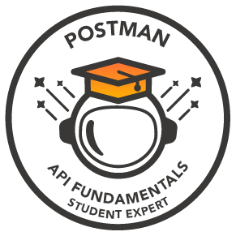

&nbsp;**Ilias Piotopoulos** 
**`Software Engineer | Computer Scientist`**

<picture>
  <source media="(prefers-color-scheme: dark)" srcset="https://raw.githubusercontent.com/ilias000/ilias000/main/Svgs/status-dark.svg">
  
</picture>

I design and build backend and full-stack software, with a focus on clean architecture, well-tested code, and secure design.

I am a computer scientist and software engineer who enjoys building things and understanding how they work. I have built web applications and backend systems in the cybersecurity, online media buying, and telecom industries, and I hold a degree in Computer Science and Telecommunications from the University of Athens.

I care about clean, efficient code. I use design patterns where they make a system easier to change, and I rely on unit and integration tests to keep quality high. Curiosity pulls me toward new areas of technology, and I enjoy challenges that push me to learn and grow.

I like being useful to the team I am part of, whether that means improving a process, delivering a solid solution, or helping others finish theirs. I keep looking for chances to push my limits and get a little better every day.

----

<h3 align="center">🧰 Skills</h3>

  <picture>
    <source media="(prefers-color-scheme: dark)" srcset="https://raw.githubusercontent.com/ilias000/ilias000/main/Svgs/skills-dark.svg">
    
  </picture>

----

<h3 align="center">🎓 Certification</h3>

  
   
  <b>Postman API Fundamentals Student Expert</b> · 2023

----

<h3 align="center">🏙️ My contributions in 3D</h3>

  <picture>
    <source media="(prefers-color-scheme: dark)" srcset="https://raw.githubusercontent.com/ilias000/ilias000/output-3d/profile-night-green.svg">
    
  </picture>

----

<h3 align="center">🐍 In case you wanted to see a snake eating my contribution graph:</h3>

  <picture>
    <source media="(prefers-color-scheme: dark)" srcset="https://raw.githubusercontent.com/ilias000/ilias000/output/github-snake-dark.svg">
    
  </picture>

----

<h3 align="center">🔗 Visit my personal website</h3>

  

----

<h3 align="center">📫 Get In Touch</h3>

<a href="https://www.linkedin.com/in/ilias-piotopoulos/"><picture><source media="(prefers-color-scheme: dark)" srcset="https://raw.githubusercontent.com/ilias000/ilias000/main/Svgs/contact-linkedin-dark.svg"></picture></a>
&nbsp;&nbsp;
<a href="mailto:admin@ilias-piotopoulos.com"><picture><source media="(prefers-color-scheme: dark)" srcset="https://raw.githubusercontent.com/ilias000/ilias000/main/Svgs/contact-email-dark.svg"></picture></a>
&nbsp;&nbsp;
<a href="https://ilias-piotopoulos.com/cv.pdf"><picture><source media="(prefers-color-scheme: dark)" srcset="https://raw.githubusercontent.com/ilias000/ilias000/main/Svgs/contact-cv-dark.svg"></picture></a>

----

<h3>💼 My Projects:</h3>
<h3 align="center">📌 Already Pinned Down</h3>

  

